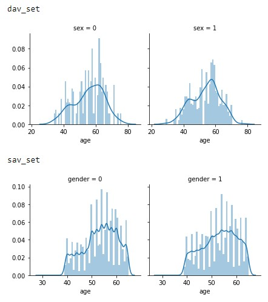
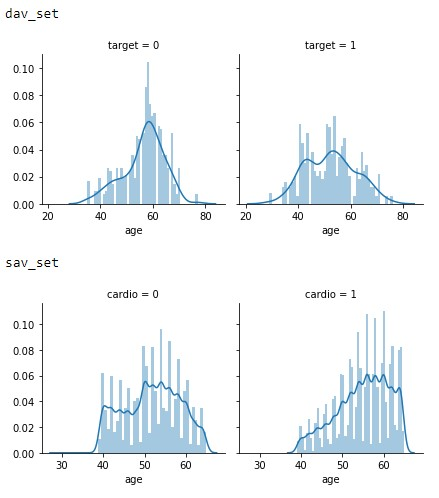
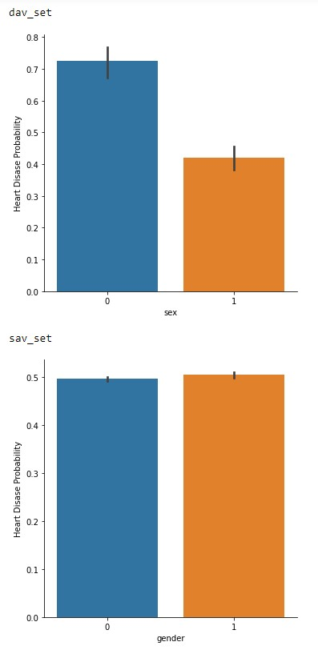
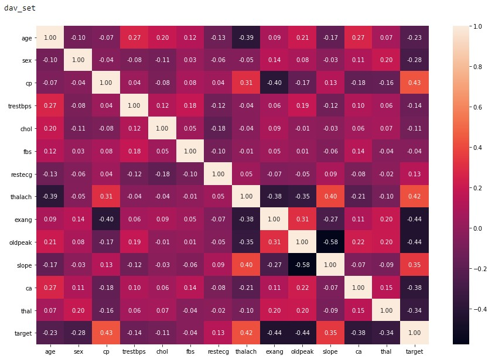
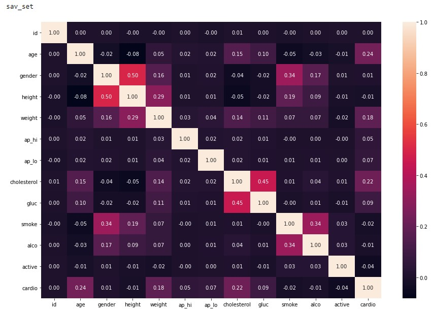

# Analysis of Various Machine Learning Classification Techniques in Detecting Heart Disease

Ethan Nguyen, [fa20-523-309](https://github.com/cybertraining-dsc/fa20-523-309), [Edit](https://github.com/cybertraining-dsc/fa20-523-309/blob/master/project/project.md)

{}
## Abstract
This section will be addressed as the project nears completion

Contents



{}

**Keywords:** health, healthcare, cardiovascular disease, data analysis

## 1. Introduction

Since cardiovascular diseases are the number 1 cause of death globally, early prevention could help in extending one’s life span and possibly quality of life. Since there are cases where patients do not show any signs of cardiovascular trouble until an event occurs, having an algorithm predict from their medical history would help in picking up on early warning signs a physician may overlook. Or could also reveal additional risk factors and patterns for research on prevention and treatment.

This project will take a high-level overview of common, widely available classification algorithms and analyze their effectiveness for this specific use case. Notable ones include, Gaussian Naive Bayes, Logistic Regression, K-Nearest Neighbors, and Support Vector Machines.

Additionally, two data sets that contain common features will be used to increase the training and test pool for evaluation. As well as to explore if additional feature types contribute to a better prediction. As it is known that a large set of data is required to reduce the possibility of the algorithm’s overfitting.

## 2. Datasets

-	https://www.kaggle.com/johnsmith88/heart-disease-dataset  
-	https://www.kaggle.com/sulianova/cardiovascular-disease-dataset

The range of creation dates are 1988 and 2019 respectively with different features of which 4 are common between. This does bring up a small hiccup in preprocessing to consider. Namely the possibility of changing diet and culture trends resulting in significantly different trends/patterns within the same age group. As well as possible differences in measurement accuracy. However this large gap is within the scope of the project in exploring which features can help provide an accurate prediction.

This possible phenomenon may be of interest to explore closely if time allows. Whether a trend itself is even present or there is an overarching trend across different cultures and time periods. Or to consider if this difference is significant enough that the data from the various sets needs to be adjusted to normalize the ages to present day.

### 2.1 Dataset Cleaning
The datasets used have already been significantly cleaned from the raw data and has been provided as a csv file. These files were then imported into the python notebook as pandas dataframes for easy manipulation. 

An initial check was made to ensure the integrity of the data matched the description from the source websites. Then some preprocessing was completed to normalize the common features between the datasets. These features were gender, age, and cholesterol levels. The first two adjustments were trivial in conversion however, in the case of cholesterol levels, the 2019 set is on a 1-3 scale while the 1988 dataset provided them as real measurements. A conversion of the 1988 dataset was done based on guidelines found online for the age range of the dataset [^1]. 

### 2.2 Dataset Analysis
From this point on, the 1988 dataset will be referred to as `dav_set` and 2019 data set will be referred to as `sav_set`.

To provide further insight on what to expect and how a model would be applied, the population of the datasets was analysed first. As depicted in Figure 2.1 the population samples of both datasets of gender vs age show the majority of the data is centered around 60 years of age with a growing slope from 30 onwards. 

  
**Figure 2.1**: Age vs Gender distributions of the dav_set and sav_set.

This trend appears to signify that the datasets focused solely on an older population or general trend in society of not monitoring heart conditions as closely in the younger generation.

Moving on to Figure 2.2, we see an interesting trend with a significant growing trend in the sav_set in older population having more cardiovascular issues compared to the dav_set. While this cannot be seen in the dav_set. This may be caused by the additional life expectancy or a change in diet as noted in the introduction.

  
**Figure 2.2**: Age vs Target distributions of the dav_set and sav_set.

In Figure 2.3, the probability of having cardiovascular issues between the sets are interesting. In the dav_set the inequality of higher probability could be attributed to the larger female samples in the dataset. With the sav_set having a more equal probability between the genders. 

  
**Figure 2.3**: Gender vs Probability of cardiovascular issues of the dav_set and sav_set.

Finally, in Figure 2.4 is the probability vs cholesterol levels. This one is very interesting between the two datasets in terms of trend levels. With the dav_set having a higher risk at normal levels compared to the sav_set. This could be another hint of a societal change across the years or may in fact be due to the low sample size. Especially since the sav_set matches the general consensus of higher cholesterol levels increasing risk of cardiovascular issues [^1].

  
**Figure 2.4**: Cholesterol levels vs Probability of cardiovascular issues of the dav_set and sav_set.

To close out this initial analysis is the correlation map of each of the features. From Figure 2.5 and 2.6 it can be concluded that both of these datasets are viable to conduct machine learning as the correlation factor is below the recommended value of 0.8 [^2]. Although we do see the signs of a low sample amount in the dav_set with a higher correlation factor compared to the sav_set.

  
**Figure 2.5**: dav_set correlation matrix.

  
**Figure 2.6**: sav_set correlation matrix.

## Project Timeline
The following is a plan for the rest of the semester, using the due dates for Assignments 8-11 as milestone dates.

### October 26
- Explore options on normalizing or conversion of the features to connect between the datasets and determine if they are viable to add to the project.
- Explore ML models and frameworks and determine viability for the project.
- Update Report.
### November 2
- Commence build out of ML models.
    - Tuning of hyperparameters as necessary.
- Update Report.
### November 9
- ML Models should be complete.
- Start analysis of the various models and their viability.
    - Additional tuning of hyperparameters as necessary.
- Update Report
### November 16
- Finalize Report and findings.

## References
[^1]: WebMD. 2020. Understanding Your Cholesterol Report. [online] Available at: <https://www.webmd.com/cholesterol-management/understanding-your-cholesterol-report> [Accessed 21 October 2020].  
[^2]: R, V., 2020. Feature Selection — Correlation And P-Value. [online] Medium. Available at: <https://towardsdatascience.com/feature-selection-correlation-and-p-value-da8921bfb3cf> [Accessed 21 October 2020].